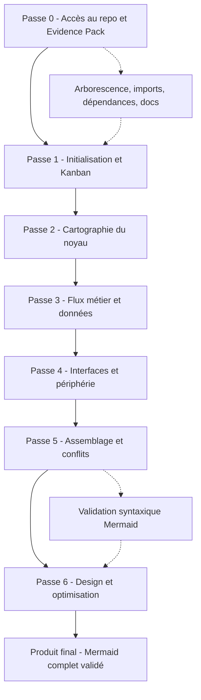
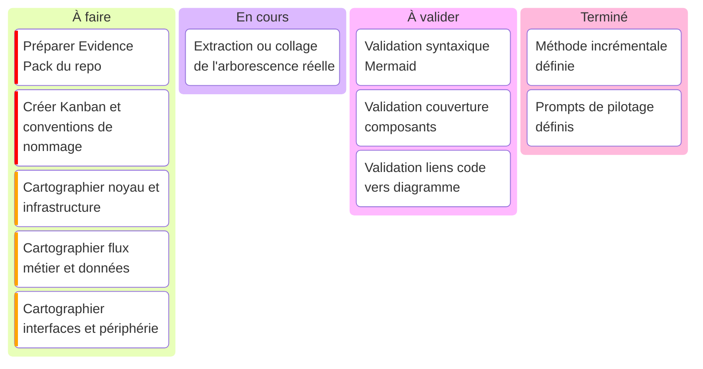
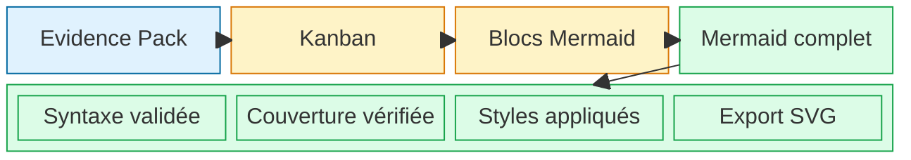
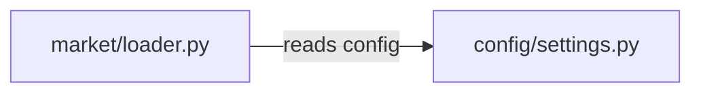
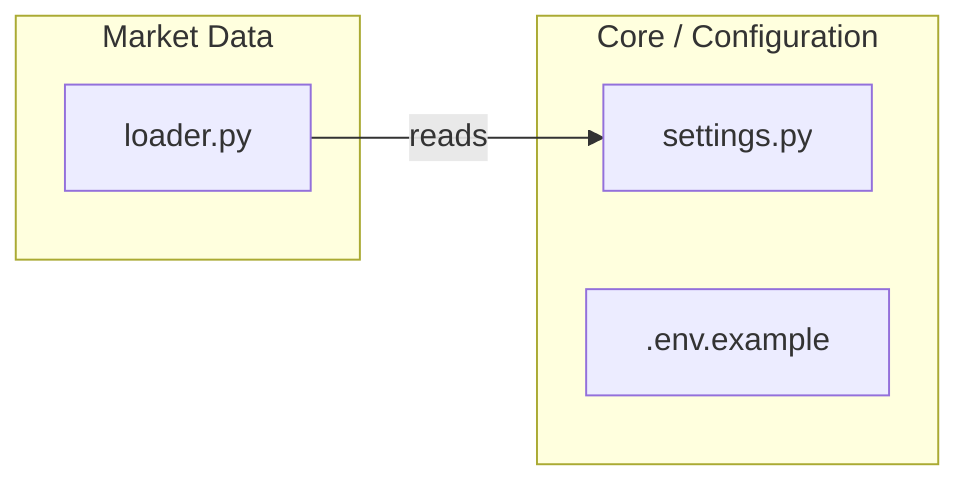

# Plan complet — Cartographie Mermaid end-to-end d’un dépôt logiciel

> Objectif : guider une IA, étape par étape, depuis un dépôt ouvert dans un IDE jusqu’à un diagramme Mermaid complet, validé, lisible et exportable.

Ce document est conçu pour être sauvegardé dans le dépôt sous :

```text
docs/architecture/PLAN_CARTOGRAPHIE_MERMAID.md
```

---

## 1. Principe directeur

L’IA ne doit jamais deviner l’architecture.

Elle doit travailler à partir d’un **Evidence Pack** généré localement depuis l’IDE ou le terminal. Ce pack contient l’arborescence, les manifests, les points d’entrée, les imports, les fichiers de tests, les fichiers d’infrastructure et les questions ouvertes.

Le produit final attendu est :

```text
docs/architecture/mermaid/990_architecture_final.mmd
```

Les fichiers intermédiaires recommandés sont :

```text
docs/architecture/
  evidence/
    00_repo_identity.md
    01_tree.txt
    02_manifests.md
    03_entrypoints.md
    04_imports_raw.txt
    05_external_dependencies.md
    06_tests.md
    07_infra.md
    08_notes_open_questions.md

  mermaid/
    000_plan.mmd
    010_core_infra.mmd
    020_data_flows.mmd
    030_business_logic.mmd
    040_interfaces_workers.mmd
    900_assembled_raw.mmd
    990_architecture_final.mmd
```

---

## 2. Pipeline global



---

## 3. Kanban de production



---

## 4. Vue produit final en block-beta



---

## 5. Passe 0 — Générer l’Evidence Pack depuis l’IDE

### 5.1 Créer les dossiers

Depuis la racine du repo :

```bash
mkdir -p docs/architecture/evidence docs/architecture/mermaid scripts
```

Créer le fichier de notes ouvertes :

```bash
touch docs/architecture/evidence/08_notes_open_questions.md
```

---

### 5.2 Créer le script d’extraction

Créer :

```text
scripts/make-architecture-evidence.sh
```

Contenu :

```bash
#!/usr/bin/env bash
set -euo pipefail

OUT="docs/architecture/evidence"
mkdir -p "$OUT"

echo "# Repo Identity" > "$OUT/00_repo_identity.md"
{
  echo
  echo "## Git"
  git rev-parse --show-toplevel 2>/dev/null || true
  git branch --show-current 2>/dev/null || true
  git rev-parse HEAD 2>/dev/null || true
  echo
  echo "## Date"
  date -u +"%Y-%m-%dT%H:%M:%SZ"
} >> "$OUT/00_repo_identity.md"

echo "# Tree" > "$OUT/01_tree.txt"
if command -v tree >/dev/null 2>&1; then
  tree -a -I ".git|node_modules|dist|build|coverage|__pycache__|.venv|venv|.next|target|vendor" >> "$OUT/01_tree.txt"
else
  find . \
    -path "./.git" -prune -o \
    -path "./node_modules" -prune -o \
    -path "./dist" -prune -o \
    -path "./build" -prune -o \
    -path "./coverage" -prune -o \
    -path "./__pycache__" -prune -o \
    -path "./.venv" -prune -o \
    -path "./venv" -prune -o \
    -type f -print | sort >> "$OUT/01_tree.txt"
fi

echo "# Manifests" > "$OUT/02_manifests.md"
for f in \
  package.json \
  pnpm-lock.yaml \
  yarn.lock \
  package-lock.json \
  pyproject.toml \
  requirements.txt \
  poetry.lock \
  Pipfile \
  go.mod \
  Cargo.toml \
  pom.xml \
  build.gradle \
  docker-compose.yml \
  docker-compose.yaml \
  Dockerfile \
  Makefile \
  README.md
 do
  if [ -f "$f" ]; then
    echo -e "\n## $f\n" >> "$OUT/02_manifests.md"
    sed -n '1,220p' "$f" >> "$OUT/02_manifests.md"
  fi
 done

echo "# Entrypoints" > "$OUT/03_entrypoints.md"
{
  echo "## Common entrypoint candidates"
  find . \
    -path "./.git" -prune -o \
    -path "./node_modules" -prune -o \
    -path "./dist" -prune -o \
    -path "./build" -prune -o \
    -type f \( \
      -name "main.*" -o \
      -name "index.*" -o \
      -name "app.*" -o \
      -name "server.*" -o \
      -name "cli.*" -o \
      -name "__main__.py" -o \
      -name "manage.py" \
    \) -print | sort
} >> "$OUT/03_entrypoints.md"

echo "# Imports Raw" > "$OUT/04_imports_raw.txt"
if command -v rg >/dev/null 2>&1; then
  rg -n \
    "^(import |from .* import |const .* = require\(|.*require\(|export .* from |using |#include |package |func main\(|class .*|def .*|APIRouter|FastAPI|Flask|express\(|Router\()" \
    --glob '!node_modules/**' \
    --glob '!dist/**' \
    --glob '!build/**' \
    --glob '!coverage/**' \
    --glob '!vendor/**' \
    --glob '!target/**' \
    . > "$OUT/04_imports_raw.txt" || true
else
  echo "ripgrep not installed. Install rg or use IDE search." >> "$OUT/04_imports_raw.txt"
fi

echo "# External Dependencies" > "$OUT/05_external_dependencies.md"
{
  echo "## Files likely declaring external dependencies"
  find . \
    -path "./.git" -prune -o \
    -path "./node_modules" -prune -o \
    -type f \( \
      -name "package.json" -o \
      -name "pyproject.toml" -o \
      -name "requirements.txt" -o \
      -name "go.mod" -o \
      -name "Cargo.toml" -o \
      -name "pom.xml" \
    \) -print | sort
} >> "$OUT/05_external_dependencies.md"

echo "# Tests" > "$OUT/06_tests.md"
{
  echo "## Test files"
  find . \
    -path "./.git" -prune -o \
    -path "./node_modules" -prune -o \
    -type f \( \
      -name "*test*" -o \
      -name "*spec*" -o \
      -path "*/tests/*" \
    \) -print | sort
} >> "$OUT/06_tests.md"

echo "# Infra" > "$OUT/07_infra.md"
{
  echo "## Infra files"
  find . \
    -path "./.git" -prune -o \
    -path "./node_modules" -prune -o \
    -type f \( \
      -name "Dockerfile" -o \
      -name "docker-compose*.yml" -o \
      -name "docker-compose*.yaml" -o \
      -name "*.tf" -o \
      -name "*.yaml" -o \
      -name "*.yml" -o \
      -path "*/.github/workflows/*" \
    \) -print | sort
} >> "$OUT/07_infra.md"

echo "Evidence pack generated in $OUT"
```

---

### 5.3 Lancer le script

```bash
chmod +x scripts/make-architecture-evidence.sh
./scripts/make-architecture-evidence.sh
```

---

### 5.4 Tâche VS Code optionnelle

Créer :

```text
.vscode/tasks.json
```

Contenu :

```json
{
  "version": "2.0.0",
  "tasks": [
    {
      "label": "Generate Architecture Evidence Pack",
      "type": "shell",
      "command": "./scripts/make-architecture-evidence.sh",
      "problemMatcher": []
    }
  ]
}
```

---

## 6. Convention de nommage Mermaid

### 6.1 Format obligatoire

```text
<zone>_<dossier>_<fichier>_<role>
```

Exemples :

```text
core_config_settings
core_db_client
data_market_loader
data_market_normalizer
api_routes_orders
api_ctrl_auth
biz_strategy_engine
exec_backtest_runner
ops_ci_github_actions
```

### 6.2 Règles

```text
- identifiants en snake_case
- pas d’accents
- pas d’espaces
- pas de slash
- pas de tiret
- labels lisibles entre ["..."]
- ne jamais utiliser end comme identifiant de nœud
- éviter les caractères spéciaux non échappés dans les labels
```

### 6.3 Exemple correct



---

## 7. Passe 1 — Initialisation et Kanban

### 7.1 Entrées à donner à l’IA

```text
docs/architecture/evidence/00_repo_identity.md
docs/architecture/evidence/01_tree.txt
docs/architecture/evidence/02_manifests.md
```

### 7.2 Prompt maître

```text
Agis en tant qu'Architecte Logiciel Senior.

Objectif : créer le plan de cartographie Mermaid incrémentale du dépôt.

Contraintes :
- Ne déduis rien qui n'est pas visible dans l'evidence pack.
- Divise le dépôt en 4 ou 5 blocs logiques maximum.
- Donne un tableau Kanban textuel.
- Donne un Kanban Mermaid.
- Donne pour chaque étape une coquille Mermaid flowchart TD avec uniquement les subgraph principaux.
- Ne détaille pas encore les fichiers internes.
- Utilise des identifiants stables en snake_case.
- Marque explicitement les inconnues avec TODO ou UNKNOWN.
```

### 7.3 Livrable

```text
docs/architecture/mermaid/000_plan.mmd
```

### 7.4 Critères d’acceptation

```text
[ ] Le Kanban contient 4 ou 5 étapes maximum
[ ] Chaque étape correspond à un bloc réel du dépôt
[ ] Les zones inconnues sont marquées TODO ou UNKNOWN
[ ] Les identifiants Mermaid sont stables
[ ] Aucun détail interne prématuré n’est généré
```

---

## 8. Passe 2 — Core, configuration, infrastructure interne

### 8.1 Entrées

```text
docs/architecture/evidence/01_tree.txt
docs/architecture/evidence/02_manifests.md
docs/architecture/evidence/03_entrypoints.md
docs/architecture/evidence/04_imports_raw.txt filtré sur config/core/db/shared/lib
docs/architecture/evidence/07_infra.md si nécessaire
```

### 8.2 Prompt

```text
Passons à l'étape : Core, configuration et infrastructure interne.

Fournis uniquement le code Mermaid brut.

Inclus :
1. Les sous-dossiers et fichiers clés de cette zone sous forme de subgraph.
2. Les dépendances internes visibles dans les imports.
3. Les connexions d'entrée et de sortie avec les autres étapes du Kanban.
4. Des identifiants explicites préfixés par core_.
5. Des commentaires Mermaid %% Evidence: path/to/file pour les points importants.

Interdictions :
- Ne pas cartographier les détails API, UI ou stratégie métier.
- Ne pas inventer de fichiers.
- Si une relation est supposée mais non prouvée, utilise une flèche pointillée et le label "probable".
```

### 8.3 Livrable

```text
docs/architecture/mermaid/010_core_infra.mmd
```

### 8.4 Critères d’acceptation

```text
[ ] Les fichiers de configuration sont présents
[ ] Les manifests pertinents sont représentés
[ ] Les entrypoints liés au core sont représentés
[ ] Les dépendances sont prouvées par imports ou manifests
[ ] Les liens incertains sont pointillés et marqués probable
```

---

## 9. Passe 3 — Données, flux métier, stratégie, pricing

### 9.1 Entrées

```text
docs/architecture/evidence/01_tree.txt
docs/architecture/evidence/04_imports_raw.txt filtré sur data, market, strategy, pricing, model, risk
README ou docs métier si présents
```

### 9.2 Prompt

```text
Passons à l'étape : Données, flux métier, stratégie et pricing.

Fournis uniquement le code Mermaid brut.

Inclus :
1. Sources de données.
2. Loaders, parsers, normalizers.
3. Modèles de pricing ou calcul.
4. Signaux, stratégies, règles de risque.
5. Dépendances internes prouvées par imports.
6. Connexions vers Core et vers Backtesting/Execution.

Préfixes d'identifiants :
- data_ pour ingestion et datasets
- market_ pour données de marché
- strat_ pour stratégie
- pricing_ pour pricing
- risk_ pour risque

Interdictions :
- Ne pas inventer de flux métier.
- Ne pas créer de broker ou exchange externe s’il n’est pas visible dans le code.
- Ne pas fusionner cette étape avec l’API ou les tests.
```

### 9.3 Livrable

```text
docs/architecture/mermaid/020_data_flows.mmd
```

### 9.4 Critères d’acceptation

```text
[ ] Sources de données représentées si visibles
[ ] Modules d’ingestion représentés
[ ] Modules de stratégie ou pricing représentés si existants
[ ] Connexions avec le core visibles
[ ] Connexions avec execution/backtesting visibles si prouvées
```

---

## 10. Passe 4 — API, interfaces, workers, CLI, exécution

### 10.1 Entrées

```text
docs/architecture/evidence/03_entrypoints.md
docs/architecture/evidence/04_imports_raw.txt filtré sur api, routes, controllers, cli, jobs, workers, execution, broker
docs/architecture/evidence/07_infra.md si les workers sont lancés par Docker, cron ou CI
```

### 10.2 Prompt

```text
Passons à l'étape : Interfaces, API, CLI, workers et exécution.

Fournis uniquement le code Mermaid brut.

Inclus :
1. Points d'entrée runtime.
2. Routes/API/handlers si présents.
3. CLI ou scripts exécutables.
4. Workers, jobs, schedulers.
5. Connecteurs externes, brokers ou exchanges si visibles.
6. Connexions vers Core, Données, Stratégie et Backtesting.

Préfixes :
- api_
- cli_
- worker_
- exec_
- broker_
- ext_

Interdictions :
- Ne pas ajouter de frontend si aucun frontend n’est visible.
- Ne pas inventer de contrôleurs.
- Ne pas créer de relation externe sans preuve.
```

### 10.3 Livrable

```text
docs/architecture/mermaid/040_interfaces_workers.mmd
```

### 10.4 Critères d’acceptation

```text
[ ] Tous les points d’entrée détectés sont représentés
[ ] Les API/routes sont représentées si présentes
[ ] Les CLI ou scripts runtime sont représentés si présents
[ ] Les workers/jobs sont représentés si présents
[ ] Les connexions inter-zones sont explicites
```

---

## 11. Passe 5 — Assemblage et résolution des conflits

### 11.1 Entrées

```text
docs/architecture/mermaid/000_plan.mmd
docs/architecture/mermaid/010_core_infra.mmd
docs/architecture/mermaid/020_data_flows.mmd
docs/architecture/mermaid/030_business_logic.mmd
docs/architecture/mermaid/040_interfaces_workers.mmd
```

### 11.2 Prompt

```text
Voici plusieurs blocs Mermaid produits séparément.

Rôle : intégrateur Mermaid.

Tâche :
- Fusionne les blocs en un seul flowchart.
- Ne supprime aucun composant.
- Résous les conflits d'identifiants.
- Harmonise les noms de subgraph.
- Supprime les doublons strictement identiques.
- Conserve les liens inter-zones.
- Vérifie que chaque subgraph possède son end.
- Vérifie toutes les flèches.
- Réponds uniquement avec le code Mermaid brut.
```

### 11.3 Livrable

```text
docs/architecture/mermaid/900_assembled_raw.mmd
```

### 11.4 Checklist syntaxique

```text
[ ] Une seule déclaration flowchart au début
[ ] Aucun ID nommé end
[ ] Tous les labels complexes sont entre ["..."]
[ ] Chaque subgraph a un end
[ ] Les flèches sont -->, -.->, ==>, --- ou <-->
[ ] Aucun caractère spécial non échappé dans les labels
[ ] Les classDef sont à la fin
[ ] Les class sont après les nœuds
[ ] Aucun block-beta mélangé dans un flowchart
[ ] Aucun diagramme kanban mélangé dans un flowchart
```

---

## 12. Passe 6 — Design, thématisation et optimisation graphique

### 12.1 Entrée

```text
docs/architecture/mermaid/900_assembled_raw.mmd
```

### 12.2 Prompt

```text
Rôle : Expert en visualisation Mermaid.

Tâche :
Optimise ce diagramme sans supprimer de composants.

Instructions :
1. Choisis l'orientation la plus lisible : LR pour architecture en couches, TD pour pipeline.
2. Regroupe les fichiers connexes dans des subgraph explicites.
3. Applique une charte via classDef.
4. Couleurs :
   - Core / config : gris
   - Données : vert
   - API / interfaces : orange
   - Métier / stratégie : violet
   - Exécution / backtesting : bleu
   - Infrastructure / CI : jaune
   - Systèmes externes : rouge clair
5. Réduis l'effet spaghetti :
   - liens inter-zones seulement entre nœuds pivots
   - liens internes détaillés dans chaque subgraph
   - liens probables en pointillé
6. Ne supprime aucun nœud.
7. Réponds uniquement avec le code Mermaid brut.
```

### 12.3 Livrable final

```text
docs/architecture/mermaid/990_architecture_final.mmd
```

### 12.4 Charte Mermaid recommandée

```mermaid
flowchart LR
  classDef core fill:#E5E7EB,stroke:#374151,color:#111827
  classDef data fill:#DCFCE7,stroke:#16A34A,color:#14532D
  classDef api fill:#FFEDD5,stroke:#EA580C,color:#7C2D12
  classDef business fill:#F3E8FF,stroke:#9333EA,color:#581C87
  classDef execution fill:#DBEAFE,stroke:#2563EB,color:#1E3A8A
  classDef infra fill:#FEF9C3,stroke:#CA8A04,color:#713F12
  classDef external fill:#FEE2E2,stroke:#DC2626,color:#7F1D1D
  classDef unknown fill:#F5F5F5,stroke:#737373,color:#404040,stroke-dasharray: 5 5
```

---

## 13. Contrat de qualité final

Le Mermaid final est accepté seulement si :

```text
[ ] 100 % des dossiers racines importants sont représentés
[ ] Tous les entrypoints détectés sont représentés
[ ] Tous les fichiers manifestes sont représentés
[ ] Les dépendances externes majeures sont visibles
[ ] Les flux principaux sont visibles de gauche à droite ou haut en bas
[ ] Les fichiers centraux ont plus de connexions que les fichiers secondaires
[ ] Les zones inconnues sont marquées UNKNOWN ou TODO
[ ] Le diagramme passe la validation Mermaid
[ ] Le diagramme est lisible en SVG
[ ] Le diagramme peut être versionné dans docs/architecture/mermaid
```

---

## 14. Format de réponse attendu de l’IA à chaque passe

Pour les passes de détail, imposer ce format strict :

```text
Réponds uniquement avec un bloc Mermaid brut.
Aucun commentaire hors code.
Aucune explication.
Aucune conclusion.
```

Exemple :



---

## 15. Stratégie IDE concrète

Dans l’IDE :

```text
1. Ouvrir le repo.
2. Lancer scripts/make-architecture-evidence.sh.
3. Donner à l’IA les fichiers :
   - 00_repo_identity.md
   - 01_tree.txt
   - 02_manifests.md
4. Générer la Passe 1.
5. Donner ensuite uniquement les extraits nécessaires pour la passe suivante.
6. Produire :
   - 010_core_infra.mmd
   - 020_data_flows.mmd
   - 030_business_logic.mmd
   - 040_interfaces_workers.mmd
7. Fusionner.
8. Optimiser.
9. Valider.
10. Exporter le SVG depuis un éditeur Mermaid.
```

---

## 16. Prompt maître à garder

```text
Agis en tant qu'Architecte Logiciel Senior et Expert Mermaid.

Nous cartographions ce dépôt de façon incrémentale à partir d'un Evidence Pack produit depuis l'IDE.

Règles absolues :
- Ne jamais inventer un fichier, une dépendance ou un flux.
- Toute relation doit venir de l'arborescence, des manifests, des imports, des entrypoints ou de la documentation.
- Les inconnues doivent être marquées TODO ou UNKNOWN.
- Les identifiants Mermaid doivent être stables, explicites, en snake_case.
- Les blocs doivent pouvoir être fusionnés sans conflit.
- Les détails sont produits étape par étape.
- À la fin, produire un Mermaid complet, validé, stylé et exportable en SVG.

Objectif final :
docs/architecture/mermaid/990_architecture_final.mmd
```

---

## 17. Prompt de démarrage pour la prochaine interaction IA

```text
Voici l’Evidence Pack initial du dépôt.

Fichiers fournis :
- 00_repo_identity.md
- 01_tree.txt
- 02_manifests.md

Agis en tant qu’Architecte Logiciel Senior.

Tâche :
1. Analyse uniquement les informations fournies.
2. Propose un découpage en 4 ou 5 étapes logiques.
3. Génère un Kanban textuel.
4. Génère un Kanban Mermaid.
5. Génère les coquilles Mermaid de chaque étape.
6. Ne détaille pas encore les fichiers internes.
7. Marque toute zone incertaine TODO ou UNKNOWN.
```

---

## 18. Arborescence finale recommandée à commiter

```text
docs/
  architecture/
    PLAN_CARTOGRAPHIE_MERMAID.md
    evidence/
      00_repo_identity.md
      01_tree.txt
      02_manifests.md
      03_entrypoints.md
      04_imports_raw.txt
      05_external_dependencies.md
      06_tests.md
      07_infra.md
      08_notes_open_questions.md
    mermaid/
      000_plan.mmd
      010_core_infra.mmd
      020_data_flows.mmd
      030_business_logic.mmd
      040_interfaces_workers.mmd
      900_assembled_raw.mmd
      990_architecture_final.mmd
scripts/
  make-architecture-evidence.sh
.vscode/
  tasks.json
```

---

## 19. Résultat final attendu

À la fin du processus, le repo doit contenir :

```text
- Une méthode reproductible de cartographie architecture
- Un Evidence Pack traçable
- Des Mermaid partiels par domaine
- Un Mermaid global brut fusionné
- Un Mermaid final propre, stylé et validé
- Un export SVG exploitable pour revue technique
```

Le fichier final de référence est :

```text
docs/architecture/mermaid/990_architecture_final.mmd
```

