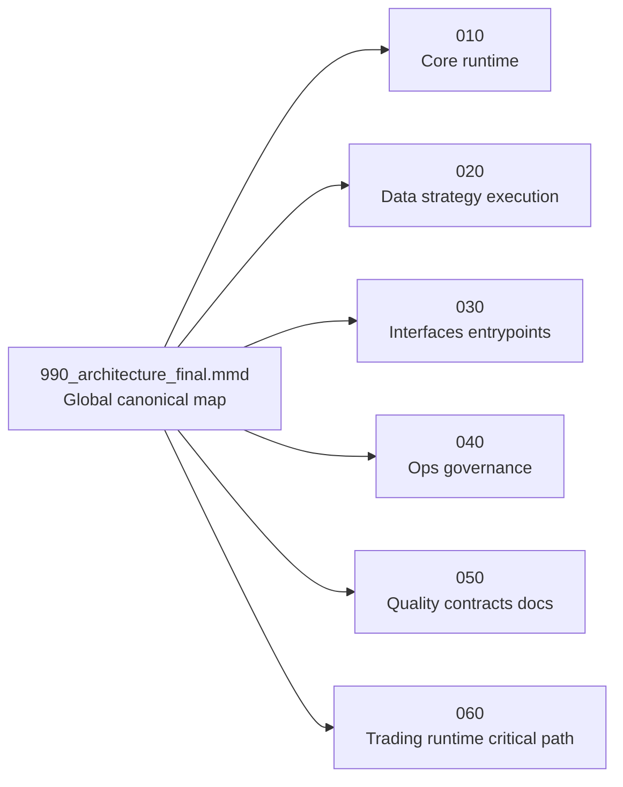

# Readable Views - Mermaid Architecture

Source canonique :

```text
docs/architecture/mermaid/990_architecture_final.mmd
```

Vues disponibles :

```text
010_core_runtime.preview.md
020_data_strategy_execution.preview.md
030_interfaces_entrypoints.preview.md
040_ops_governance.preview.md
050_quality_contracts_docs.preview.md
060_trading_runtime_critical_path.preview.md
```

Notes :

- Ces vues servent a la lecture quotidienne.
- `990_architecture_final.mmd` reste la carte globale canonique.
- Les liens `probable`, `UNKNOWN` et `TODO` sont conserves.
- Les fichiers generes comme `__pycache__` sont exclus visuellement des vues lisibles.


