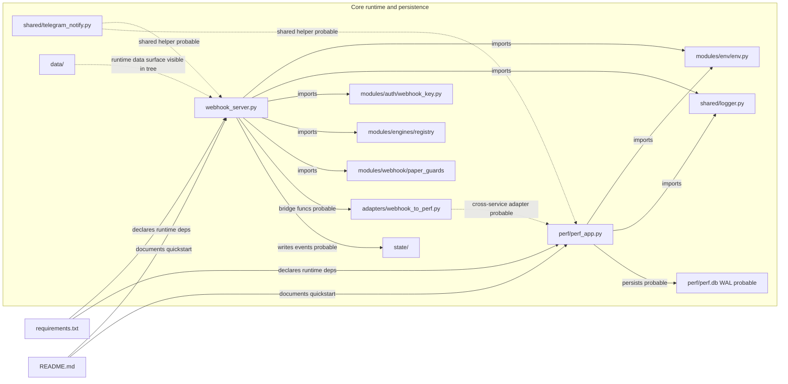

# Readable View - Core Runtime

Source canonique :

```text
docs/architecture/mermaid/990_architecture_final.mmd
```

Scope : core runtime, persistence et dependances d'entree principales.


```mermaid
flowchart LR
  requirements_txt["requirements.txt"]
  readme_md["README.md"]

  subgraph core_runtime["Core runtime and persistence"]
    webhook_server_py["webhook_server.py"]
    perf_perf_app_py["perf/perf_app.py"]
    modules_env_env_py["modules/env/env.py"]
    shared_logger_py["shared/logger.py"]
    shared_telegram_notify_py["shared/telegram_notify.py"]
    modules_auth_webhook_key_py["modules/auth/webhook_key.py"]
    modules_engines_registry["modules/engines/registry"]
    modules_webhook_paper_guards["modules/webhook/paper_guards"]
    adapters_webhook_to_perf_py["adapters/webhook_to_perf.py"]
    data_root_dir["data/"]
    state_root_dir["state/"]
    perf_db_sqlite["perf/perf.db WAL probable"]
  end

  requirements_txt -->|declares runtime deps| webhook_server_py
  requirements_txt -->|declares runtime deps| perf_perf_app_py
  readme_md -->|documents quickstart| webhook_server_py
  readme_md -->|documents quickstart| perf_perf_app_py

  webhook_server_py -->|imports| modules_env_env_py
  webhook_server_py -->|imports| shared_logger_py
  webhook_server_py -->|imports| modules_auth_webhook_key_py
  webhook_server_py -->|imports| modules_engines_registry
  webhook_server_py -->|imports| modules_webhook_paper_guards
  webhook_server_py -->|bridge funcs probable| adapters_webhook_to_perf_py
  webhook_server_py -->|writes events probable| state_root_dir

  perf_perf_app_py -->|imports| modules_env_env_py
  perf_perf_app_py -->|imports| shared_logger_py
  perf_perf_app_py -->|persists probable| perf_db_sqlite
  adapters_webhook_to_perf_py -.->|cross-service adapter probable| perf_perf_app_py
  shared_telegram_notify_py -.->|shared helper probable| webhook_server_py
  shared_telegram_notify_py -.->|shared helper probable| perf_perf_app_py
  data_root_dir -.->|runtime data surface visible in tree| webhook_server_py
```
