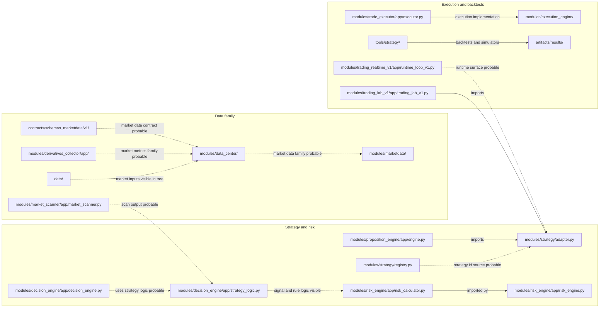

# Readable View - Data Strategy Execution

Source canonique :

```text
docs/architecture/mermaid/990_architecture_final.mmd
```

Scope : data family, strategy, risk et execution.


```mermaid
flowchart LR
  subgraph data_family["Data family"]
    data_root_dir["data/"]
    modules_data_center["modules/data_center/"]
    modules_marketdata["modules/marketdata/"]
    modules_market_scanner["modules/market_scanner/app/market_scanner.py"]
    modules_derivatives_collector["modules/derivatives_collector/app/"]
    contracts_marketdata["contracts/schemas_marketdata/v1/"]
  end

  subgraph strategy_and_risk["Strategy and risk"]
    modules_decision_engine["modules/decision_engine/app/decision_engine.py"]
    modules_strategy_logic["modules/decision_engine/app/strategy_logic.py"]
    modules_strategy_adapter["modules/strategy/adapter.py"]
    modules_strategy_registry["modules/strategy/registry.py"]
    modules_risk_calculator["modules/risk_engine/app/risk_calculator.py"]
    modules_risk_engine["modules/risk_engine/app/risk_engine.py"]
    modules_proposition_engine["modules/proposition_engine/app/engine.py"]
  end

  subgraph execution_and_backtests["Execution and backtests"]
    modules_execution_engine["modules/execution_engine/"]
    modules_trade_executor["modules/trade_executor/app/executor.py"]
    modules_trading_lab_v1["modules/trading_lab_v1/app/trading_lab_v1.py"]
    modules_trading_realtime_v1["modules/trading_realtime_v1/app/runtime_loop_v1.py"]
    tools_strategy_root["tools/strategy/"]
    artifacts_results["artifacts/results/"]
  end

  data_root_dir -.->|market inputs visible in tree| modules_data_center
  modules_derivatives_collector -.->|market metrics family probable| modules_data_center
  modules_data_center -.->|market data family probable| modules_marketdata
  modules_market_scanner -.->|scan output probable| modules_strategy_logic
  contracts_marketdata -.->|market data contract probable| modules_data_center

  modules_decision_engine -.->|uses strategy logic probable| modules_strategy_logic
  modules_strategy_registry -.->|strategy id source probable| modules_strategy_adapter
  modules_strategy_logic -.->|signal and rule logic visible| modules_risk_calculator
  modules_risk_calculator -->|imported by| modules_risk_engine
  modules_proposition_engine -->|imports| modules_strategy_adapter
  modules_trading_lab_v1 -->|imports| modules_strategy_adapter
  modules_trading_realtime_v1 -.->|runtime surface probable| modules_strategy_adapter

  modules_trade_executor -->|execution implementation| modules_execution_engine
  tools_strategy_root -->|backtests and simulators| artifacts_results
```
