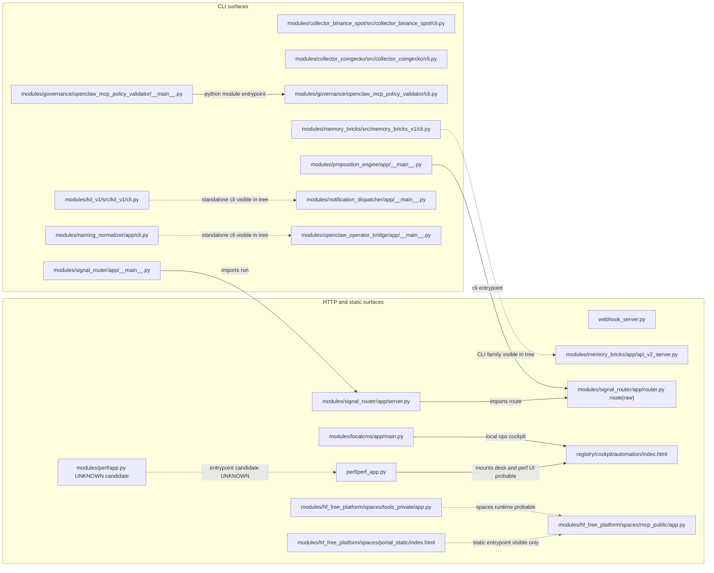

# Readable View - Interfaces And Entrypoints

Source canonique :

```text
docs/architecture/mermaid/990_architecture_final.mmd
```

Scope : HTTP, CLI et surfaces statiques. Fichiers generes exclus visuellement.


