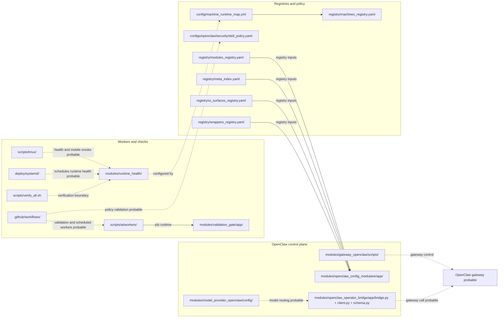

# Readable View - Ops Governance

Source canonique :

```text
docs/architecture/mermaid/990_architecture_final.mmd
```

Scope : orchestration, governance, registries, workers et control plane OpenClaw.


