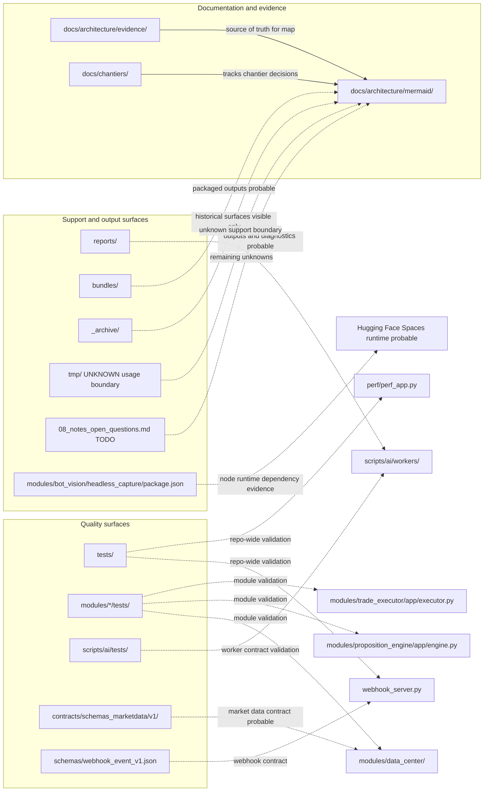

# Readable View - Quality Contracts Docs

Source canonique :

```text
docs/architecture/mermaid/990_architecture_final.mmd
```

Scope : evidence, documentation, tests, contracts et sorties de support.


