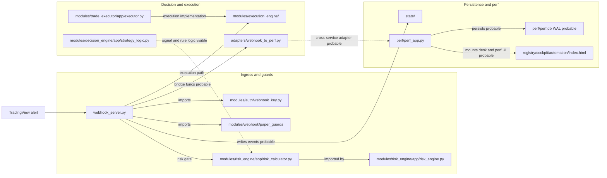

# Readable View - Trading Runtime Critical Path

Source canonique :

```text
docs/architecture/mermaid/990_architecture_final.mmd
```

Scope : chemin runtime trading critique de l'alerte jusqu'a la persistence et aux surfaces perf.


