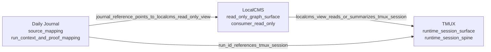

# WHY Runtime Graph - Local Render v0

## Source

- JSON source: `docs/chantiers/GO_OPT_TRADING_DOC_OPS_WHY_RUNTIME_GRAPH_JSON_EXPORT_REAL_01/artifacts/why-runtime-graph-export.real.v0.json`
- Source graph: `why_runtime_graph_minimal_v1`
- Source export: `why-runtime-graph-export.real.v0`
- Source scope: `localcms_tmux_daily_journal_minimal`
- Render mode: local bounded Markdown render
- Dashboard: disabled
- Runtime live view: disabled
- Runtime mutation: disabled

## Render

## Nodes

| JSON id | Label | Type | Status |
| --- | --- | --- | --- |
| `surface:localcms` | LocalCMS | `read_only_graph_surface` | `consumer_read_only` |
| `surface:tmux` | TMUX | `runtime_session_surface` | `runtime_session_spine` |
| `surface:daily_journal` | Daily Journal | `source_mapping` | `run_context_and_proof_mapping` |

## Edges

| From | Relation | To |
| --- | --- | --- |
| `surface:localcms` | `localcms_view_reads_or_summarizes_tmux_session` | `surface:tmux` |
| `surface:daily_journal` | `run_id_references_tmux_session` | `surface:tmux` |
| `surface:daily_journal` | `journal_reference_points_to_localcms_read_only_view` | `surface:localcms` |

## Provenance

| Source id | Source GO | Role |
| --- | --- | --- |
| `runtime_surface_inventory` | `GO_OPT_TRADING_DOC_OPS_WHY_RUNTIME_GRAPH_SURFACES_INVENTORY_01` | `inventory` |
| `localcms_tmux_graph_integration` | `GO_OPT_TRADING_DOC_OPS_WHY_LOCALCMS_TMUX_GRAPH_INTEGRATION_01` | `source_surface` |
| `daily_journal_graph_export_mapping` | `GO_OPT_TRADING_DOC_OPS_WHY_DAILY_JOURNAL_GRAPH_EXPORT_MAPPING_01` | `mapping` |

## Limits

- This is a local Markdown render from the validated JSON artifact.
- This is not a dashboard.
- This is not a live runtime view.
- This does not mutate runtime state.
- This does not modify CI, validators, or global indexes.
- This does not infer nodes or edges outside the validated JSON source.
