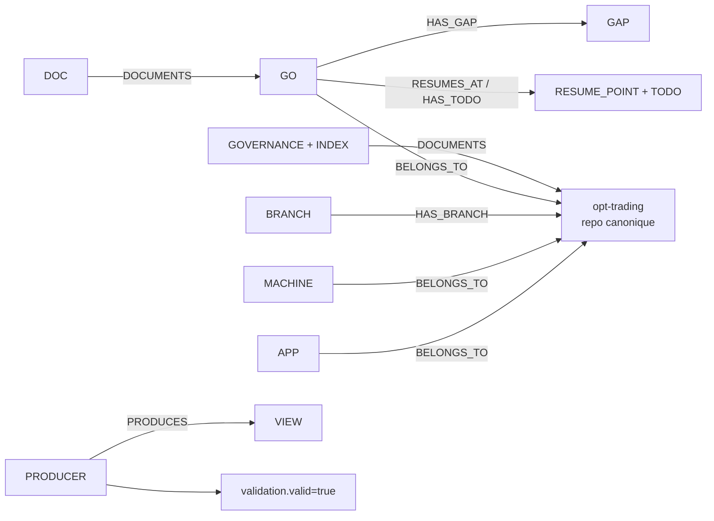
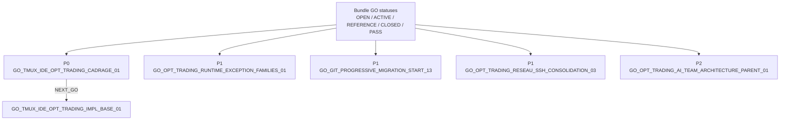
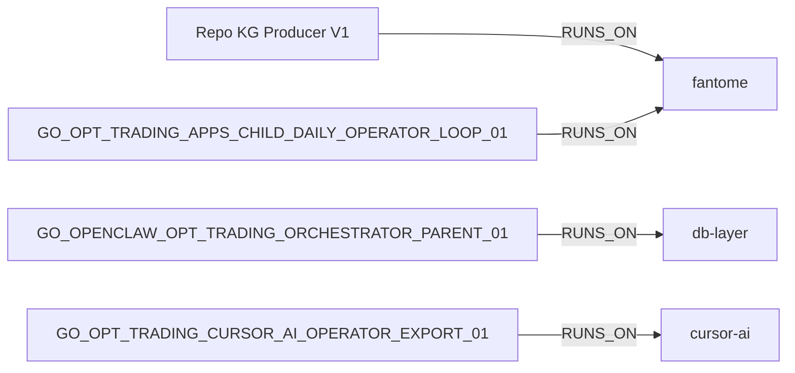
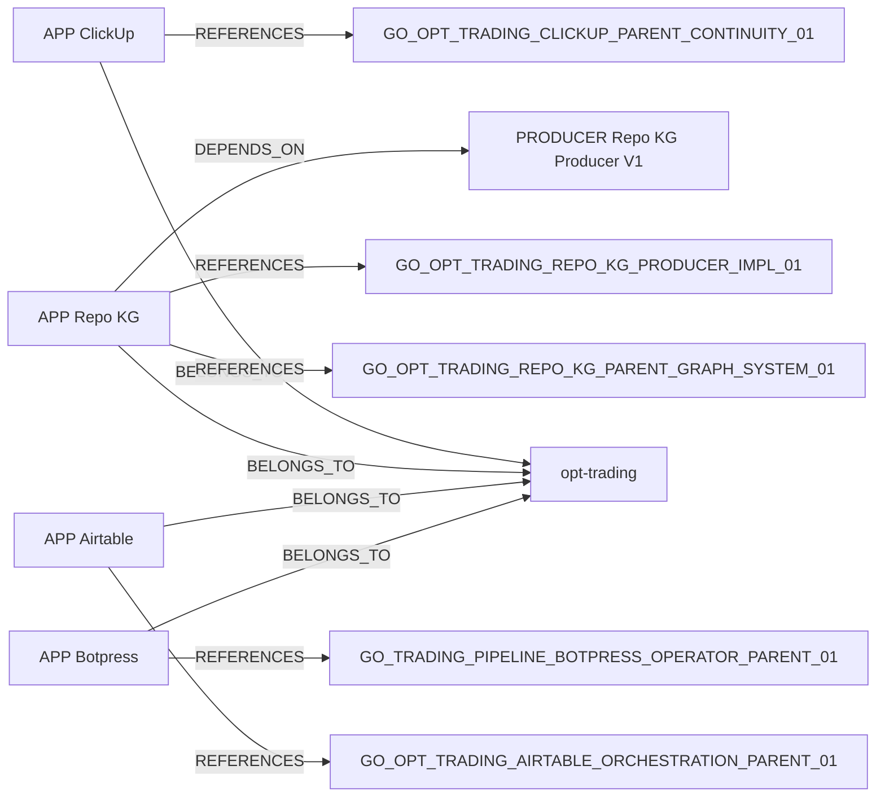
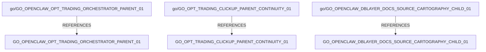
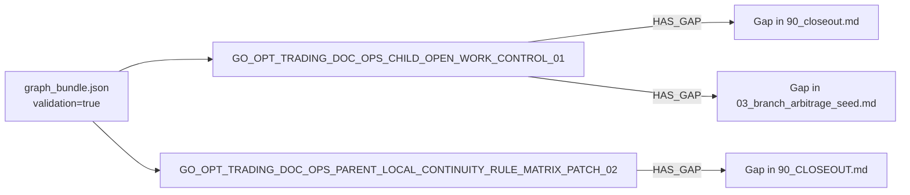
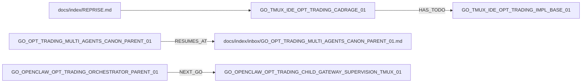

# 02_MERMAID_REPLAY - GO_OPT_TRADING_REPO_KG_CHILD_PRODUCER_VIEW_ALIGNMENT_01

Les vues ci-dessous rejouent les surfaces V1 impactees par l'alignement du Producer.

## 1_REPO_GLOBAL_MAP_V1

Source : `graph_bundle.json`.



## 2_GO_ACTIVE_MAP_V1

Source : `graph_bundle.json` + overlay priorite `GO_INDEX.md` / `REPRISE.md`.



## 3_MACHINE_MAP_V1

Source : `graph_bundle.json`.



## 4_APPS_MAP_V1

Source : `graph_bundle.json`.



## 5_BRANCH_MAP_V1

Source : `graph_bundle.json` + overlay de classement `BRANCH_STATE.md`.



## 6_RISK_GAP_MAP_V1

Source : `graph_bundle.json`.



## 7_REPRISE_MAP_V1

Source : `graph_bundle.json` + ordre de lecture `REPRISE.md`.



## 8_NOTE

`DOC_CANON_MAP_V1` et `MODULE_SURFACE_MAP` ne regressent pas dans ce lot ; le delta utile portait sur apps, runtime, branches, gaps, reprise et statuts GO.

## 17_RESUME_POINT

```text
docs/chantiers/GO_OPT_TRADING_REPO_KG_CHILD_PRODUCER_VIEW_ALIGNMENT_01/90_CLOSEOUT.md
-> relire ensuite graph_bundle.json si un nouveau lot graphique est ouvert
```

## RISKS

- À qualifier.
